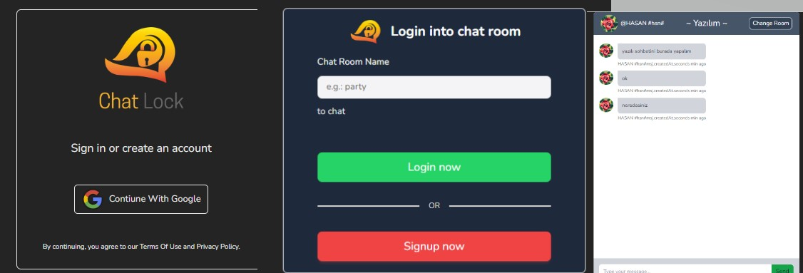

# React + Vite + Tailwind
# Chat-Lock

- Chat-Lock Projesi
Chat-Lock, Firebase kullanarak geliştirilmiş bir sohbet uygulamasıdır. Bu uygulama, gerçek zamanlı iletişim için Firebase Firestore ve Firebase Authentication gibi Firebase ürünlerini kullanır.

* Özellikler
- Gerçek zamanlı sohbet: Kullanıcılar anlık olarak mesajlaşabilirler.
- Kullanıcı kimlik doğrulama: Firebase Authentication ile kullanıcılar giriş yapabilir ve kullanıcı kimlik bilgileri mesajlarda görüntülenebilir.
- Odalara katılma: Kullanıcılar farklı sohbet odalarına katılabilirler.
- Mesaj gönderme: Kullanıcılar metin mesajları gönderebilirler.
- Mesaj tarih sıralaması: Mesajlar oluşturulma tarihine göre sıralanır.

* Giriş Yapma

Uygulamayı açtığınızda, Firebase Authentication ile giriş yapmanız gerekecektir.
Giriş yapmak için Google hesabınızı kullanabilirsiniz.
* Sohbet Odası Seçme
Giriş yaptıktan sonra, mevcut sohbet odalarından birini seçebilirsiniz. Eğer istediğiniz bir oda yoksa, yeni bir oda oluşturabilirsiniz.
* Sohbet Etme
Seçtiğiniz sohbet odasına katıldığınızda, diğer kullanıcılarla gerçek zamanlı olarak sohbet edebilirsiniz.
Mesaj yazmak için metin kutusunu kullanın ve "Gönder" düğmesine tıklayın.
* Oda Değiştirme
Sohbet odasını değiştirmek isterseniz, ekranın sağ üst köşesinde bulunan "Change Room" düğmesine tıklayabilirsiniz.

## Önizleme

# Chat-Lock-FirebaseProject
